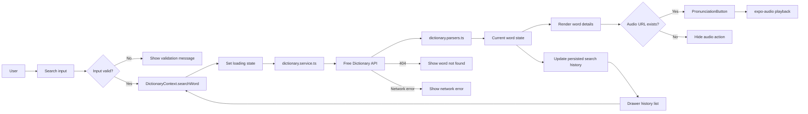
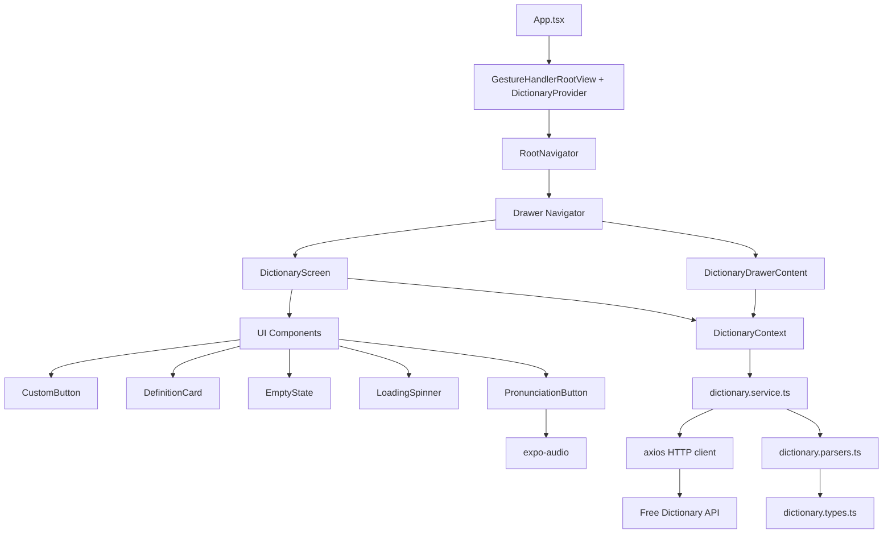
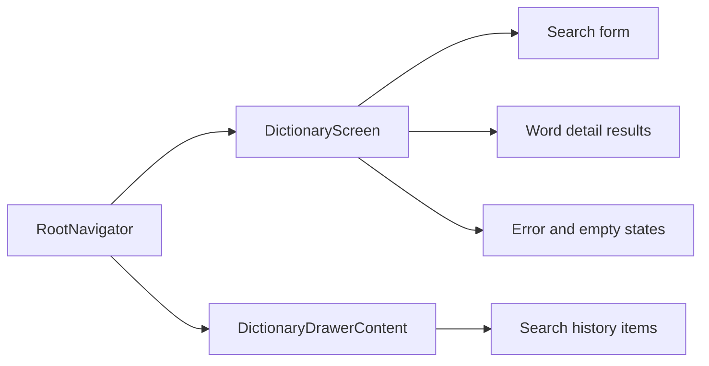

# Dictionary Mobile App Design

## Project Summary

Lexi Dictionary is a cross-platform React Native app built with Expo SDK 54. It lets users search English words, view definitions, phonetics, examples, and play pronunciation audio where available.

The app does not require a custom backend. It consumes the public Free Dictionary API directly through an axios service.

## Data Flow Diagram



## Application Architecture



## API Endpoint

No internal API endpoints need to be developed for this exam app.

The app consumes this external endpoint:

| Method | Endpoint | Purpose |
| --- | --- | --- |
| GET | `https://api.dictionaryapi.dev/api/v2/entries/en/{word}` | Fetch word, phonetics, meanings, definitions, examples, and audio URLs |

Example request:

```txt
GET https://api.dictionaryapi.dev/api/v2/entries/en/example
```

Expected response handling:

| Case | App behavior |
| --- | --- |
| `200` | Parse and display word details |
| `404` | Show a user-friendly word not found message |
| Network failure | Show a connection error and allow retry |
| Malformed response | Show a safe generic error without crashing |

## Pages To Develop



### DictionaryScreen

Main page for the application.

Responsibilities:

- Accept word input.
- Validate empty input.
- Trigger API search.
- Show loading state.
- Show searched word and phonetic spelling.
- Render parts of speech, definitions, and examples.
- Show pronunciation buttons only when audio URLs exist.
- Show friendly error and empty states.

### DictionaryDrawerContent

Drawer menu for search history.

Responsibilities:

- Show successfully searched words.
- Prevent duplicate history entries.
- Allow tapping a history item to search it again.
- Keep the current detail screen refreshed with the selected history word.

## Current Folder Structure

```txt
src/
  components/
    CustomButton.tsx
    DefinitionCard.tsx
    EmptyState.tsx
    LoadingSpinner.tsx
    PronunciationButton.tsx

  navigations/
    DictionaryDrawerContent.tsx
    RootNavigator.tsx

  screens/
    DictionaryScreen.tsx

  services/
    dictionary.service.ts
    history.service.ts

  store/
    DictionaryContext.tsx

  theme/
    colors.ts
    spacing.ts

  types/
    dictionary.types.ts
    navigation.types.ts

  utils/
    dictionary.parsers.ts
    searchValidation.ts

  constants/
    dictionary.ts
```

## Dependency Plan

Required dependencies kept:

- `expo`
- `react`
- `react-native`
- `axios`
- `expo-audio`
- `expo-font`
- `expo-splash-screen`
- `@expo-google-fonts/poppins`
- `@expo/vector-icons`
- `@react-native-async-storage/async-storage`
- `@react-navigation/native`
- `@react-navigation/drawer`
- `react-native-gesture-handler`
- `react-native-reanimated`
- `react-native-worklets`
- `react-native-safe-area-context`
- `react-native-screens`
- `react-dom`
- `react-native-web`
- `@expo/metro-runtime`

Removed finance/auth dependencies:

- `@react-native-community/datetimepicker`
- `@react-navigation/bottom-tabs`
- `@react-navigation/native-stack`
- `react-native-chart-kit`
- `react-native-svg`
- `zustand`
